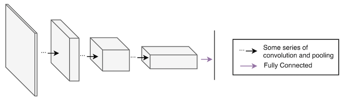
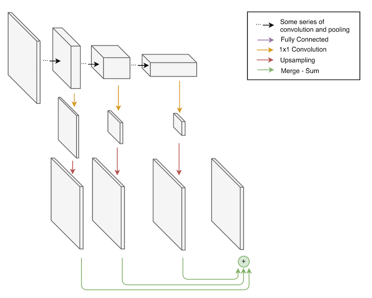
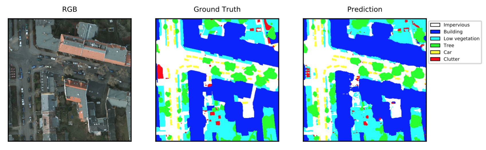
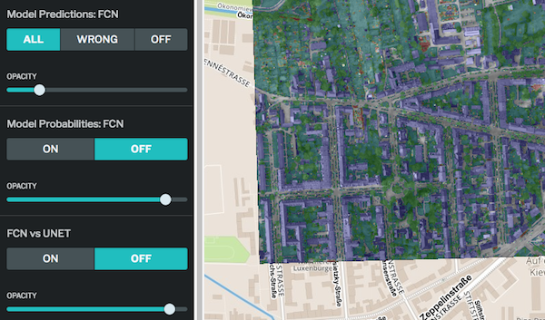

## Deep learning for semantic segmentation of aerial imagery

### Introduction

[Aerial imagery](https://en.wikipedia.org/wiki/Orthophoto) consists of pictures of the earth taken by airplanes, balloons and UAVs, and can be used to create and update maps.

TODO describe socially beneficial applications of aerial imagery

Increasingly, [computer vision](https://en.wikipedia.org/wiki/Computer_vision) is being used to make sense of this vast source of data. A key task in computer vision is semantic segmentation, which attempts to simultaneously answer the questions of what is in an image, and where it is located. More formally, the task is to assign to each pixel a meaningful label such as "road" or "building."

To facilitate the evaluation of approaches to segmenting aerial imagery, [ISPRS](http://www.isprs.org/default.aspx) has released a benchmark [dataset](http://www2.isprs.org/commissions/comm3/wg4/2d-sem-label-potsdam.html) containing 5cm resolution imagery collected over Potsdam, Germany. The images have five channels including red, green, blue, IR and elevation, and have been labeled by hand with six labels including impervious, buildings, low vegetation, trees, cars, and clutter, for anything not in the previous categories.

TODO images of potsdam dataset

[Deep learning](https://en.wikipedia.org/wiki/Deep_learning) has been successfully applied to a wide range of computer vision problems including semantic segmentation for aerial imagery \[[1](http://www.icml.cc/2012/papers/318.pdf)\]. At Azavea, we have been exploring these techniques on the ISPRS benchmark, and have made [our code](https://github.com/azavea/keras-semantic-segmentation/) open source to help others get started in this area.

To construct and train neural networks, we use the popular [Keras](https://keras.io/) and [Tensorflow](https://www.tensorflow.org/) libraries. Our code is designed following the principles in the blog post ["Patterns for Research in Machine Learning"](
http://arkitus.com/patterns-for-research-in-machine-learning/), and is intended to make it easy to try different datasets, data generators, model architectures, hyperparameter settings, and evaluation methods. In the rest of this blog post, we describe the main model architecture we used, how we implemented it in Keras and Tensorflow, various experiments we ran using the ISPRS benchmark, and some ways of visualizing the results.

### Fully Convolutional Networks

There has been a lot of research on using [convolutional neural networks](http://cs231n.github.io/) for image recognition, where the task is to predict a single label for an entire image. It would be nice if we could adapt a model that is good at recognition into a model that is good at segmentation.
Traditional recognition models consist of a series of convolutional and pooling layers followed by a fully-connected layer that maps from a 3D array to a 1D vector of probabilities.



One challenge is that recognition models have 1D output (a probability for each label), whereas segmentation models have 3D output (a probability vector for each pixel). We can obtain a "fully convolutional" model that has 3D output by removing the final fully-connected layer. However, the final convolutional layer will have too many channels (typically > 512) and will have very low spatial resolution (typically 8x8). To get the desired output shape, we can use a 1x1 convolutional layer which squashes the number of channels down to the number of labels, and then use bilinear interpolation to upsample back to the spatial resolution of the input image.

Despite having the correct resolution, the output will be spatially coarse, since it is the result of upsampling, and the model will have trouble segmenting small objects such as cars. To solve this problem, we can incorporate information from earlier, finer-grained layers into the output of the model. We can do this by performing convolution and upsampling on the final 32x32, 16x16, and 8x8 layers of the recognition model, and then sum these together to get the output.



TODO remove fully connected from legend

This model architecture for semantic segmentation is known as a [Fully Convolutional Network](https://arxiv.org/abs/1605.06211) (FCN), and is very popular. It was originally proposed as an adaptation of the [VGG](https://arxiv.org/abs/1409.1556) recognition model, but can be applied in a straightforward manner to newer recognition models, such as [ResNets](https://arxiv.org/abs/1512.03385) which we used in our experiments. One advantage of the FCN over other architectures is that it is easy to initialize the bulk of the model using weights that were obtained from training on a large object recognition dataset such as [ImageNet]((http://www.image-net.org/)). This is often helpful when the size of the training set is small relative to model complexity.

Here is a code snippet that shows how to construct an FCN from a ResNet using Keras. It's remarkable how concisely this can be expressed and how closely the code matches the graphical representation.
```python
# A ResNet model with weights from training on ImageNet. This will
# be adapted via graph surgery into an FCN.
base_model = ResNet50(
    include_top=False, weights='imagenet', input_tensor=input_tensor)

# Get final 32x32, 16x16, and 8x8 layers in the original
# ResNet by that layers's name. These are the "skip connections."
x32 = base_model.get_layer('act3d').output
x16 = base_model.get_layer('act4f').output
x8 = base_model.get_layer('act5c').output

# Compress each skip connection so it has nb_labels channels.
c32 = Convolution2D(nb_labels, 1, 1, name='conv_labels_32')(x32)
c16 = Convolution2D(nb_labels, 1, 1, name='conv_labels_16')(x16)
c8 = Convolution2D(nb_labels, 1, 1, name='conv_labels_8')(x8)

# Resize each compressed skip connection using bilinear interpolation.
# This operation isn't built into Keras, so we use a LambdaLayer
# which allows calling a Tensorflow operation.
def resize_bilinear(images):
    return tf.image.resize_bilinear(images, [nb_rows, nb_cols])

r32 = Lambda(resize_bilinear, name='resize_labels_32')(c32)
r16 = Lambda(resize_bilinear, name='resize_labels_16')(c16)
r8 = Lambda(resize_bilinear, name='resize_labels_8')(c8)

# Merge the three layers together using summation.
m = merge([r32, r16, r8], mode='sum', name='merge_labels')

# Pass it through softmax to get probabilities. We need to reshape
# and then un-reshape because Keras expects input to softmax to
# be 2D.
x = Reshape((nb_rows * nb_cols, nb_labels))(m)
x = Activation('softmax')(x)
x = Reshape((nb_rows, nb_cols, nb_labels))(x)

fcn_model = Model(input=input_tensor, output=x)
```

### Experiments

We ran many experiments, and the following are some of the most interesting. Each experiment was specified by a JSON file stored in version control, which helped keep us organized and makes it easier to replicate our results.

#### Experiment 1
This experiment used a ResNet50-based FCN with
connections from the last 32x32, 16x16, and 8x8 layers of the ResNet.
We trained the model using a random initialization for 100 epochs with 4096
samples per epoch with a batch size of 8 using the Adam optimizer with a
learning rate of 1e-5. The input to the network consisted of red, green, blue, elevation, infrared, and NDVI channels. The [NDVI](https://en.wikipedia.org/wiki/Normalized_Difference_Vegetation_Index) channel is a function of red and infrared channels which tends to highlight vegetation. The training data consisted of 80% of the labeled data, and was randomly augmented using 90 degree rotations and horizontal and vertical flips. The training process took ~8 hrs on an NVIDIA Tesla K80 GPU. The network takes 256x256 windows of data as input. To generate predictions for larger images, we make predictions over a sliding window (with 50% overlapping of windows) and stitch the resulting predictions together. We obtained the following scores on the validation set, which is composed of 20% of the development dataset. The overall score is the accuracy for all labels, and the individual scores are [F1](https://en.wikipedia.org/wiki/F1_score) scores.

| | Overall | Impervious | Building | Low Vegetation | Tree | Car | Clutter |
| --- | --- | --- | --- | --- | --- | --- | --- |
| Validation | 84.9 | 88.1 | 91.6 | 81.2 | 81.2 | 91.0 | 65.5 |

Here are some predictions from the learned model over a 2000x2000 tile from the validation set. The predictions look generally correct, although the model struggles with the clutter category and finding exact boundaries, especially of the natural categories of low vegetation and trees.



The configuration file for this experiment can be found [here](https://github.com/azavea/keras-semantic-segmentation/blob/develop/src/experiments/4_5_17/fcn_resnet_all_scratch_low_lr.json) and the code for the model [here](https://github.com/azavea/keras-semantic-segmentation/blob/develop/src/semseg/models/fcn_resnet.py).

#### Experiment 2

This experiment was the same as the previous, except that it used pretraining, initializing the ResNet with weights learned on ImageNet. Since the model trained on ImageNet only had three input channels, we could only use three of the available input channels, and selected infrared, red and green. We expected this to perform worse than Experiment 1 because we were ignoring potentially valuable input channels including elevation and NDVI, and because pretraining is typically only useful when there is a small quantity of data, which was not the case. But, surprisingly, there was a 2.4% increase in the accuracy over the previous experiment. This improvement was first noted in a [report](https://arxiv.org/abs/1606.02585) by Jamie Sherrah.

| | Overall | Impervious | Building | Low Vegetation | Tree | Car | Clutter |
| --- | --- | --- | --- | --- | --- | --- | --- |
| Validation | 87.3 | 89.7 | 93.1 | 83.0 | 84.3 | 94.7 | 75.9 |

The configuration file for this experiment can be found [here](https://github.com/azavea/keras-semantic-segmentation/blob/develop/src/experiments/4_7_17/fcn/fcn_resnet_iirg_cross_4.json).

#### Experiment 3

This experiment was the same as the previous except that it trained five models using 5-fold [cross-validation](https://en.wikipedia.org/wiki/Cross-validation_(statistics)), and combined them together as an [ensemble](https://en.wikipedia.org/wiki/Ensemble_learning). In particular, we trained 5 models, each using a different 20% of the dataset as the validation dataset. The models were then combined by averaging their predictive distributions. Combining models together as an ensemble usually increases accuracy if the ensemble is diverse -- that is, if the individual models tend to make different mistakes. In order to increase the diversity of the ensemble, we trained each individual model with a different random initialization (for the non-pretrained weights in the model) and a different dataset.

| | Overall | Impervious | Building | Low Vegetation | Tree | Car | Clutter |
| --- | --- | --- | --- | --- | --- | --- | --- |
| Test | x | x | x | x | x | x | x |

TODO add test results once they are on the leaderboard

The configuration file for this experiment can be found [here](https://github.com/azavea/keras-semantic-segmentation/blob/develop/src/experiments/4_7_17/fcn/).

TODO compare results to other entrants

#### Other experiments
We ran a number of other experiments that didn't work as well, so will only discuss them briefly. First, we tried the [U-Net](https://arxiv.org/abs/1505.04597) architecture, which has been successful for biomedical image segmentation and is derived from an [autoencoder](https://en.wikipedia.org/wiki/Autoencoder) architecture. It performed better than the FCN trained from scratch using all input channels (Experiment 1), but worse than the FCN using pretraining (Experiment 2), with the following scores.

| | Overall | Impervious | Building | Low Vegetation | Tree | Car | Clutter |
| --- | --- | --- | --- | --- | --- | --- | --- |
| Validation | 85.8 | 89.1 | 91.8 | 82.0 | 83.3 | 93.7 | 63.2 |
| Test | 89.2 | 91.4 | 96.1 | 86.1 | 86.6 | 93.3 | 46.8 |

The configuration file for this experiment can be found [here](https://github.com/azavea/keras-semantic-segmentation/blob/develop/src/experiments/3_21_17/unet_all.json), and the code for the model [here](https://github.com/azavea/keras-semantic-segmentation/blob/develop/src/semseg/models/unet.py).

We also tried the recently proposed [Fully Convolutional DenseNet](https://arxiv.org/abs/1611.09326) architecture, which is like a U-Net that uses [DenseNet](https://arxiv.org/abs/1608.06993) blocks. The results were around the same as the U-Net, but took about 8 times longer to train. The configuration file for this experiment can be found [here](https://github.com/azavea/keras-semantic-segmentation/blob/develop/src/experiments/3_14_17/densenet.json), and the code for the model [here](https://github.com/azavea/keras-semantic-segmentation/blob/develop/src/semseg/models/fc_densenet.py).

To improve on the results in Experiment 2, we thought it made sense to create a network that could combine the benefits of pretraining with the benefits of having access to all the available input channels. We created a new FCN architecture that combined a pretrained ResNet for the infrared, red, and green channels, and a randomly initialized ResNet for the elevation, NDVI, and blue channels. There wasn't a noticeable improvement though, perhaps because the blue and NDVI channels are redundant, and the elevation channel has errors in it, and only helps the building category, which we do well on to begin with.
The configuration file for this experiment can be found [here](https://github.com/azavea/keras-semantic-segmentation/blob/develop/src/experiments/4_6_17/dual_fcn_resnet.json), and the code for the model [here](https://github.com/azavea/keras-semantic-segmentation/blob/develop/src/semseg/models/dual_fcn_resnet.py).

In all of these experiments, we might have been able to achieve higher performance with a greater degree of hyperparameter tuning or with some simple architectural refinements, so we hesitate to make any strong conclusions about them.

TODO mention results on vaihingen dataset

### Visualization

To allow us to look at the output of the trained models in an interactive fashion, we created an app using [Geotrellis](https://geotrellis.io/) and [Leaflet](http://leafletjs.com/). It stitches together all the predictions of the model over the labeled part of the Potsdam dataset and displays them on a map. This allows us to pan and zoom over the entire city, which is more convenient than looking at a series of static images. The opacity slider makes it easy to view predictions that are aligned with the input. We can also highlight incorrect predictions, view raw label probabilities, and compare the output of different model architectures.



TODO insert movie - can't in Github markdown

TODO funny bloopers?
